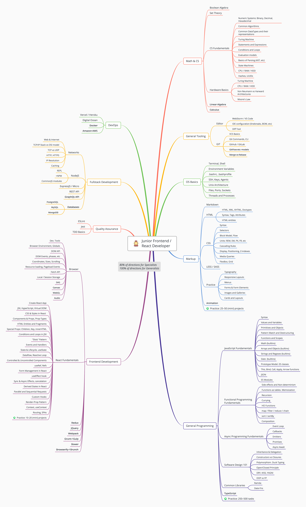
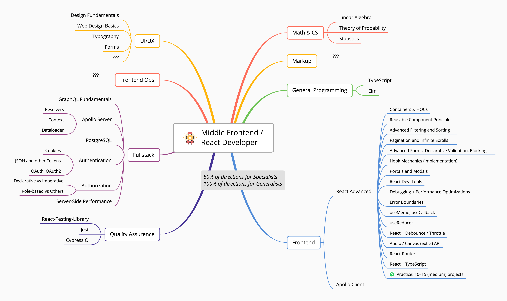
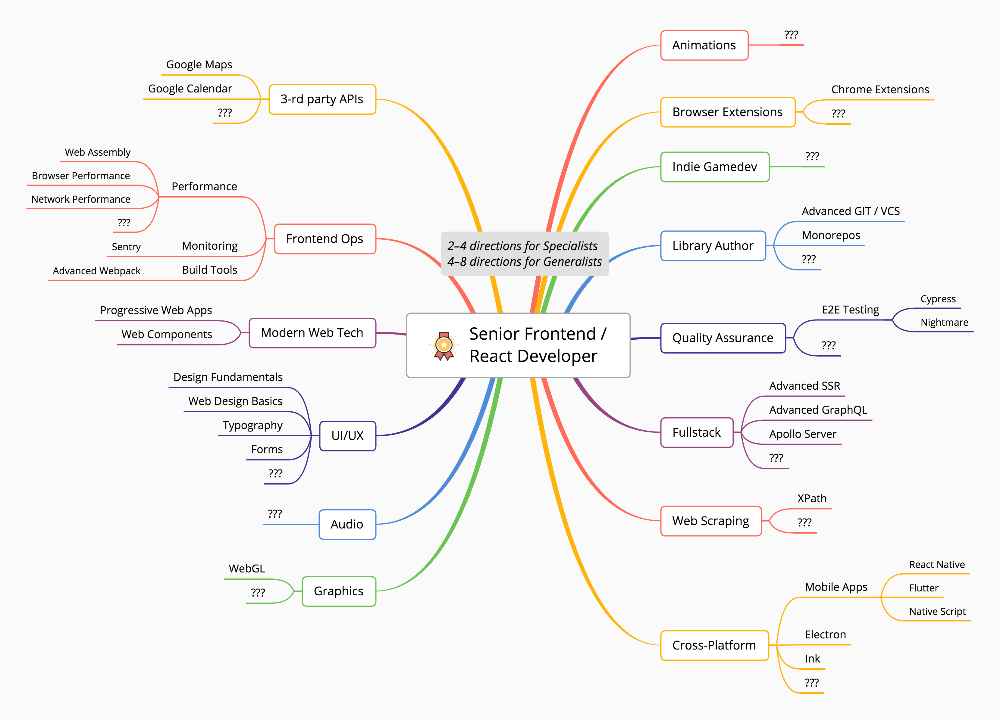
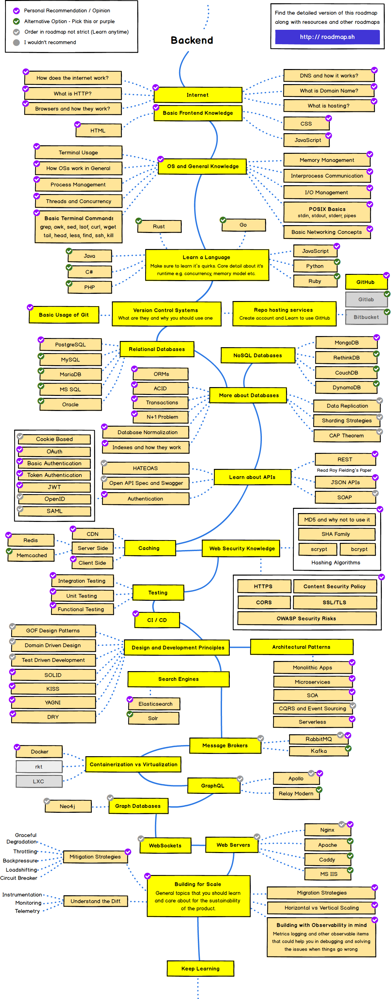

# Mind Map For Full Stack/ Front End Developers In 2020 By Hemant (Feel Free To Follow And Star Me on Github)
 
*Note: work in progress...*

`Please ★ this repo to show you care about the further updates.`

##Full Stack Mind Map.

1. Front-End Basic.

[**Front End -Full Stack**](frontenddev.png?raw=true)(image)

2. Back-End Basic.

[**Back End -Full Stack**](frontenddev.png?raw=true)(image)

3. Dev-Ops Basic.

[**Dev Ops -Full Stack**](devops.png?raw=true)(image)

## Dedicated Front End Mind Map.

 1. Junior Frontend Developer
[**Junior Frontend Developer**](junior.png?raw=true) (image)

2. Middle Frontend Developer
[**Middle Frontend Developer**](middle.png?raw=true) (image)
3. Senior Frontend Developer
[**Senior Frontend Developer**](senior.png?raw=true) (image)

## Recommendations
 *This is a mindmap featured repo by Hemant Joshi follow me on github.* @8bithemant
 
 
 1.
>Hey Dev's out there this is a mindmap form basic to advance if you wish to you can pick your topic from  the map and search them randomly on youtube and study then one by one which will be time saving and a lot helpfull. 

2.
>I will suggest you to make a todo list with all the tasks you got to do and work on them one by one and fork this repo to make sure you have your own mindmap of developer.

3.
>Thank you and if this was helpful share it and make sure you star and follow me on github and twitter.

>>Github: https://github.com/8bithemant

>>Twitter: https://twitter.com/8bithemant

##Front End MindMap

##Full Stack MindMap

#Thank You Beautiful People.

